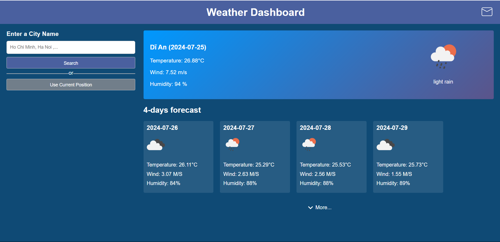

# G-Weather-Forecast App

Welcome to the `G-Weather`, an application for real-time and forecasted weather information. Built with precision and user-friendliness in mind, this app ensures you stay updated with the weather conditions of your city or any city around the globe.


## Features


### Weather Forecast
- **Description**: View the weather forecast for the next 4 days or More.The temporary weather information history will be saved and allow display again during the day.
- **Screenshot**: 
### Current Weather Information
- **Description**: Get detailed current weather information including temperature, wind speed, and humidity.
- **Screenshot**: 

### Daily Weather Forecast Subscription / Unsubscription

#### 1. Subscribe
- **Description**: Subscribe with your email to receive daily weather forecasts. Email confirmation is required for subscription.
- **Screenshot**: 

#### 2. Mail Notification
- **Description**: After subscribing, you will receive a notification email to confirm your subscription.
- **Screenshot**: 

#### 3. Confirm Subscription
- **Description**: Click on the link provided in the notification email to confirm your subscription.
- **Screenshot**: 

#### 4. Unsubscribe
- **Description**: At any time, you can unsubscribe from receiving daily weather forecasts.
- **Screenshot**: 
### Daily Notification
- **Description**: After subscribe,  you will receive a daily weather forecast base on the your current position at 8AM every day.
- **Screenshot**: 

### Responsive Design


#### 1. Tablet Device

#### 2. Mobile Device


## Technical Stack

- **Frontend**: ReactJs
- **Backend**: ExpressJS, MongoDB

## Setup
To get the G-Weather app running locally, let's follow these steps:

1. **Clone the repository**
```git
git clone https://github.com/ddhuu/WebDev_Intern_Assignment
cd  WebDev_Intern_Assignment
```
2. **Install dependencies**
- For the frontend:
```bash
cd client
npm insall
```
- For the backend:
```bash
cd server
npm insall
```
- For the scheduler-sever:
```bash
cd cron-job
npm insall
```
3. **Add your environment variables**
4. **Start the server**
```bash
cd server
node server.js
```
5. **Start the frontend**
```bash
cd client
npm run dev
```
5. **Start the Scheduler**
```bash
cd cron-job
node app.js
```


## Deployment
- **Frontend**: https://weather-app-fe-five.vercel.app/
- **Backend**: https://api-weather-app-yit5.onrender.com/
- **Cron-Job Server**: https://api-weather-scheduler.onrender.com/
## Demo
- **Video Demo**: [Youtube](https://www.youtube.com/watch?v=Qs2lRw1DFkE)


