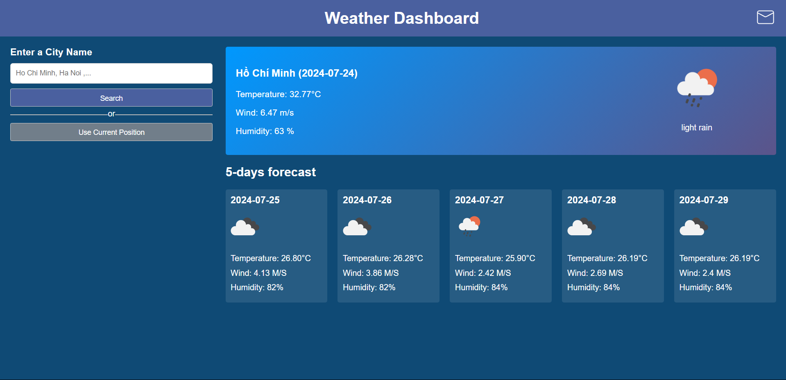
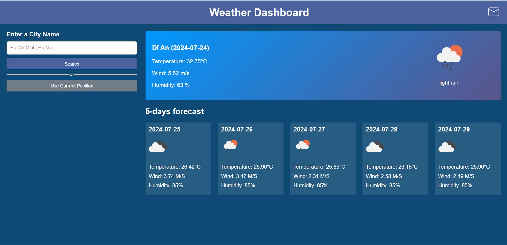
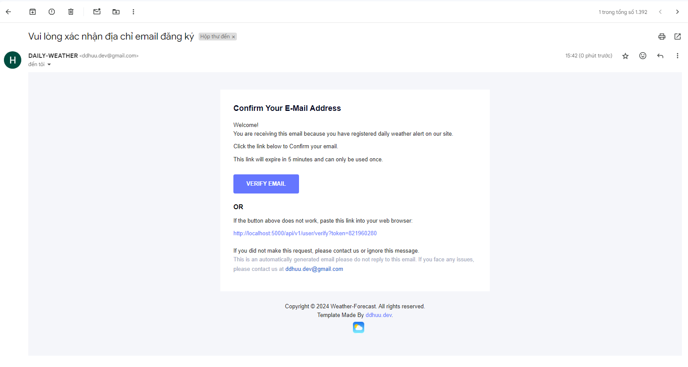
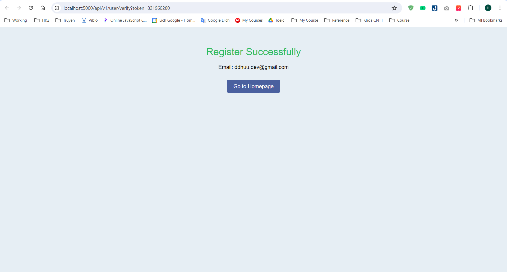
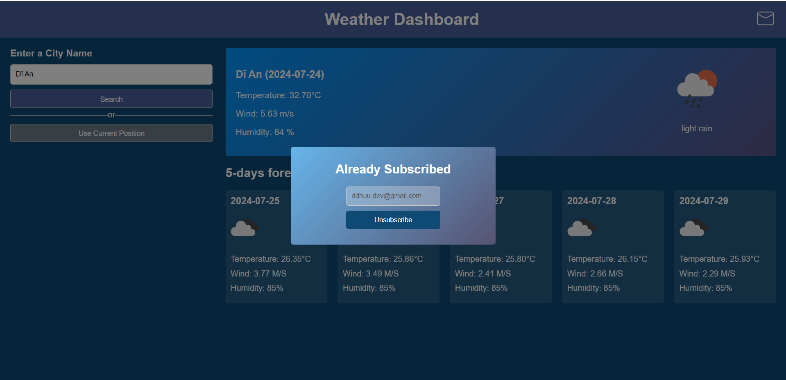
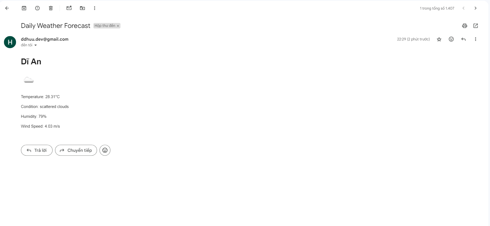
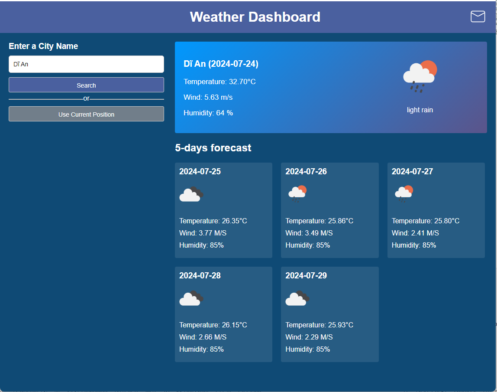
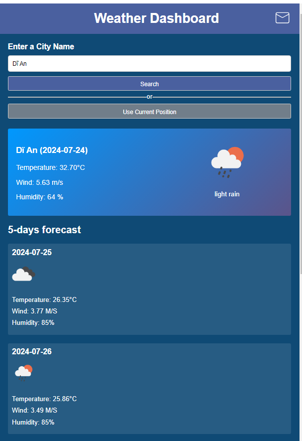

# G-Weather-Forecast App

Welcome to the `G-Weather`, an application for real-time and forecasted weather information. Built with precision and user-friendliness in mind, this app ensures you stay updated with the weather conditions of your city or any city around the globe.

## Features

### Weather Forecast
- **Description**: View the weather forecast for the next 5 days.
- **Screenshot**: 
### Current Weather Information
- **Description**: Get detailed current weather information including temperature, wind speed, and humidity.
- **Screenshot**: 

### Daily Weather Forecast Subscription / Unsubscription

#### 1. Subscribe
- **Description**: Subscribe with your email to receive daily weather forecasts. Email confirmation is required for subscription.
- **Screenshot**: 

#### 2. Mail Notification
- **Description**: After subscribing, you will receive a notification email to confirm your subscription.
- **Screenshot**: 

#### 3. Confirm Subscription
- **Description**: Click on the link provided in the notification email to confirm your subscription.
- **Screenshot**: 

#### 4. Unsubscribe
- **Description**: At any time, you can unsubscribe from receiving daily weather forecasts.
- **Screenshot**: 
### Daily Notification
- **Description**: After subscribe,  you will receive a daily weather forecast base on the your current position at 8AM every day.
- **Screenshot**: 

### Responsive Design

#### 1. Tablet Device

#### 2. Mobile Device

## Technical Stack

- **Frontend**: ReactJs
- **Backend**: ExpressJS

## Deployment